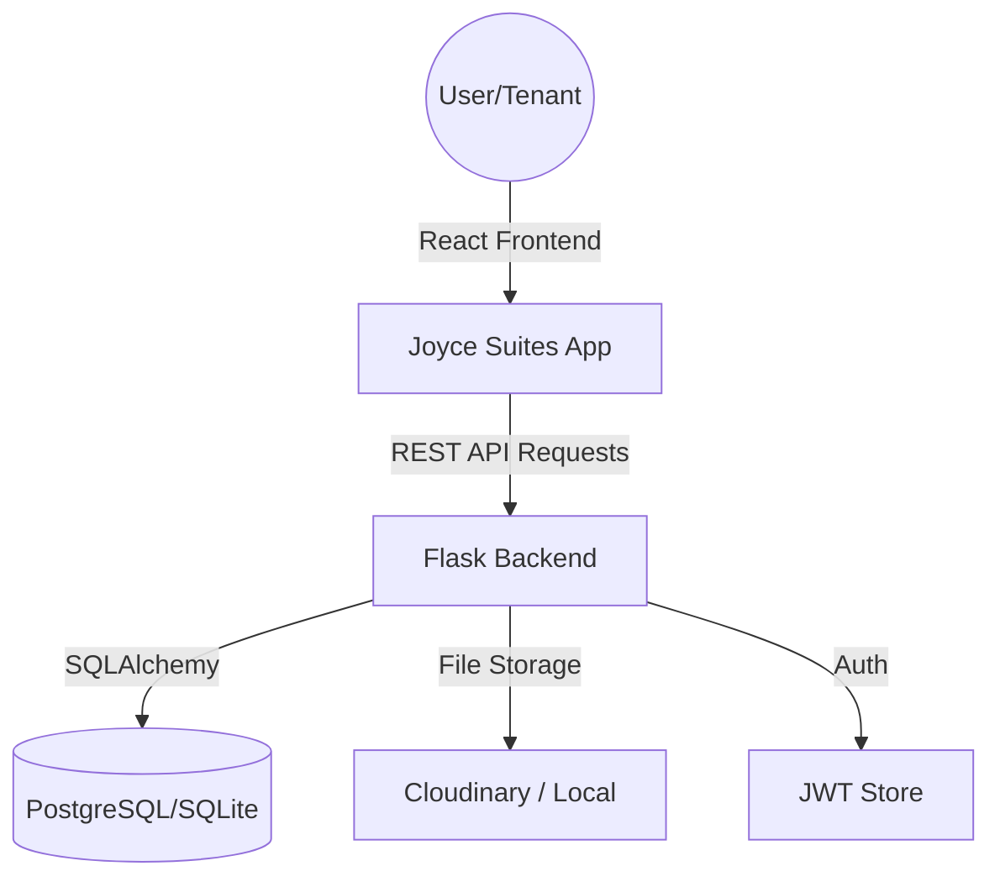

# Joyce Suites Apartments - Property Management System

A modern, full-stack Property Management System (PMS) designed to streamline tenant registration, booking inquiries, lease management, and maintenance tracking for Joyce Suites Apartments.

## 🚀 Features

### For Tenants
- **Online Booking Inquiries**: Submit inquiries for vacant rooms directly from the platform.
- **Dynamic Registration**: Secure tenant onboarding with ID document and photo uploads.
- **Digital Lease Signing**: Integrated signature canvas for signing lease agreements electronically.
- **Personalized Dashboard**: Track payment history, maintenance requests, and notifications.
- **Maintenance Requests**: Submit and track the status of room repairs with priority levels.
- **Vacate Notices**: Submit and manage move-out notices online.

### For Caretakers & Admins
- **Occupancy Overview**: Real-time tracking of vacant, reserved, and occupied units.
- **Inquiry Management**: Review, approve, or reject booking inquiries.
- **Tenant Management**: View and manage tenant profiles, leases, and documents.
- **Payment Verification**: Mark payments as received and track financial records.
- **Maintenance Tracking**: Manage all repair requests from a centralized dashboard.
- **Automated Notifications**: Send system-wide or tenant-specific updates.

## 🛠️ Technology Stack

### Frontend
- **Framework**: React.js 18
- **Navigation**: React Router 6
- **State Management**: Context API
- **Styling**: Vanilla CSS (Modern design with glassmorphism and responsiveness)
- **Utilities**: Lucide-React icons, React Signature Canvas

### Backend
- **Framework**: Flask (Python 3.x)
- **Database**: PostgreSQL (Production) / SQLite (Development)
- **ORM**: SQLAlchemy
- **Authentication**: JWT (JSON Web Tokens) with CSRF protection
- **Validation**: Marshmallow (Schemas)
- **Automation**: Celery (Optional background tasks)

## 📦 Project Structure

```bash
Joyce-Suites/
├── backend/            # Flask API, Models, Routes, Migrations
├── joyce-suites/       # React Frontend Application
└── README.md           # Project Documentation
```

## 🏗️ Project Architecture



## 📋 Core Workflows

1. **Onboarding**: Inquirers browse public rooms -> Submit inquiry -> Approved by Caretaker -> Register with room-specific link -> Sign Lease.
2. **Maintenance**: Tenant submits repair request -> Caretaker views and assigns priority -> Status updates visible to Tenant.
3. **Finances**: Tenant views account details -> Makes manual payment -> Caretaker verifies and marks as paid -> Balance updates.

## ⚙️ Setup & Installation

### Backend Setup
1. Navigate to the backend directory:
   ```bash
   cd backend
   ```
2. Create and activate a virtual environment:
   ```bash
   python -m venv venv
   source venv/bin/activate  # Windows: venv\Scripts\activate
   ```
3. Install dependencies:
   ```bash
   pip install -r requirements.txt
   ```
4. Configure environment variables in `.env`:
   ```env
   SECRET_KEY=your_secret_key
   SQLALCHEMY_DATABASE_URI=sqlite:///joyce_suites.db
   CLOUDINARY_CLOUD_NAME=your_name
   CLOUDINARY_API_KEY=your_key
   CLOUDINARY_API_SECRET=your_secret
   ```
5. Run migrations and start the server:
   ```bash
   flask db upgrade
   python seed.py  # Optional: Seed initial data
   flask run
   ```

### Frontend Setup
1. Navigate to the frontend directory:
   ```bash
   cd joyce-suites
   ```
2. Install dependencies:
   ```bash
   npm install
   ```
3. Start the development server:
   ```bash
   npm start
   ```

## 🔐 Security Features
- **JWT Authentication**: Secure token-based access with refresh mechanisms.
- **CSRF Protection**: Guarding against cross-site request forgery.
- **Rate Limiting**: Preventing brute-force attacks on sensitive endpoints.
- **Secure Storage**: Sensitive documents are handled with secure paths or Cloudinary integration.

## 📄 License
MIT License.

---
Built with ❤️ for Joyce Suites Apartments.
