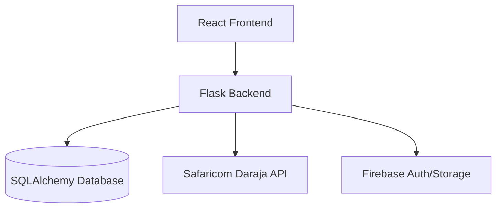

# Joyce-Suites System Documentation

## 1. Executive Summary
Joyce-Suites is a comprehensive Property Management System designed to streamline interactions between landlords, caretakers, and tenants. The system automates property management tasks such as leasing, rent collection (via M-Pesa), maintenance tracking, and reporting.

## 2. System Architecture

The system follows a classic client-server architecture:

- **Frontend**: A React application providing a responsive web interface for different user roles.
- **Backend**: A Flask (Python) RESTful API handling business logic, authentication, and data persistence.
- **Database**: SQLite (Development) / PostgreSQL (Production, via SQLAlchemy ORM).

### 2.1 Component Diagram

## 3. Core Functionalities

### 3.1 User Management & Roles
The system supports four primary roles:
- **Admin**: Full system access, financial reports, and high-level management.
- **Caretaker**: Day-to-day operations, tenant management, and maintenance oversight.
- **Tenant**: Rent payments, maintenance requests, and lease viewing.
- **Landlord**: View property status and financial performance.

### 3.2 Property & Lease Management
- **Property Catalog**: Manage rooms (Bedsitters, One-Bedrooms) with status (Vacant, Occupied, Under Maintenance).
- **Lease Workflow**: Digital lease creation, signing tracking, and automatic rent generation.

### 3.3 Financial System
- **Rent & Deposit**: Tracking payments, generating bills, and managing deposits.
- **M-Pesa Integration**: Automated payment initiation (STK Push) and callback processing for real-time payment confirmation.
- **Water Billing**: Meter reading tracking and automated bill calculation.

### 3.4 Maintenance & Communications
- **Maintenance Requests**: Tenants report issues; caretakers/admins track resolution status.
- **Notifications**: Automated alerts for payments, maintenance updates, and general announcements.

## 4. Technical Stack

### Backend (Python/Flask)
- **Framework**: Flask
- **ORM**: SQLAlchemy
- **Migration**: Flask-Migrate
- **Security**: JWT (Flask-JWT-Extended), Flask-CORS, Flask-Limiter.
- **Services**: Custom services for M-Pesa integration and reporting.

### Frontend (React)
- **Library**: React 18
- **Routing**: React Router DOM 6
- **Styling**: Tailwind CSS & Vanilla CSS
- **Icons**: Lucide React
- **Signature**: signature-canvas (for digital leases)

## 5. Database Schema (Core Models)

### `User`
| Field | Type | Description |
|---|---|---|
| id | Integer | Primary Key |
| public_id | String | Unique External ID |
| role | Enum | tenant, caretaker, admin, landlord |
| email | String | Unique Email |
| national_id | Integer | Kenyan ID Number |

### `Property`
| Field | Type | Description |
|---|---|---|
| id | Integer | Primary Key |
| name | String | Room Number/Name |
| property_type | Enum | bedsitter, one_bedroom |
| rent_amount | Float | Monthly Rent |
| status | Enum | vacant, occupied, etc. |

### `Lease`
| Field | Type | Description |
|---|---|---|
| id | Integer | Primary Key |
| tenant_id | Integer | Foreign Key to User |
| property_id | Integer | Foreign Key to Property |
| status | Enum | active, signed, expired |

## 6. API Endpoints (Highlights)

| Method | Endpoint | Description |
|---|---|---|
| POST | `/api/auth/login` | User authentication |
| GET | `/api/admin/overview` | Admin dashboard statistics |
| POST | `/api/payments/stk-push` | Initiate M-Pesa payment |
| GET | `/api/tenant/dashboard` | Tenant-specific data |
| PUT | `/api/maintenance/<id>` | Update maintenance status |

## 7. Deployment & Configuration
- **Backend Host**: Render.com (Gunicorn server)
- **Frontend Host**: Vercel
- **Environment Variables**: Managed via `.env` (Database URIs, M-Pesa credentials, Secret Keys).
- **Vercel Config**: `vercel.json` defines build commands and output directories.
